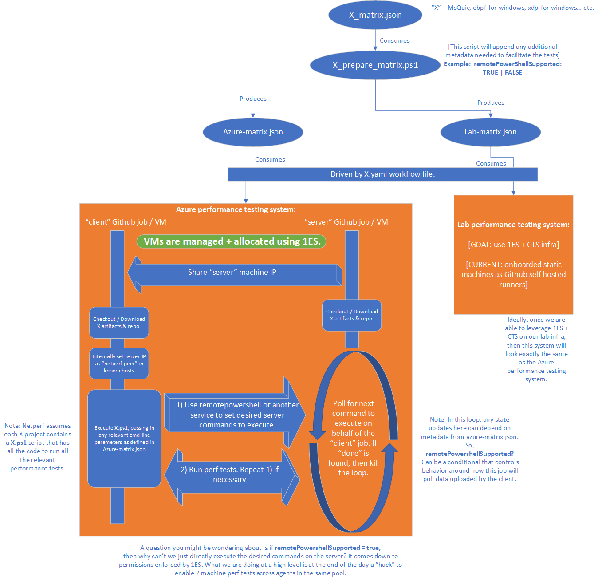

The 2 ways we facilitate peer-to-peer communication to administer 2-machine perf tests is through:

### 1. Remote Powershell
### 2. Shared Cache

---

By default, we prefer remote powershell and use it for lab scenarios.

For 1ES Azure scenarios, we found that remote powershell does not work in Linux environments, and lacks privilege in Windows - limiting behavior. We still try to use remote powershell on Windows, but have to resort to a shared cache service for Linux.

But if we use virtual machines directly, remote powershell works for both Windows / Linux Azure VMs. It seems 1ES pools has a few restrictions here on inter-agent communication.

## 1ES Focus

Our goal is to transition all our testing scenarios (lab / Azure) to be controlled and facilitated using 1ES hosted pools. As of (05/29/2024), we are not using 1ES for lab, instead having each agent registered as a self-hosted runner and offload the setup / teardown of environments to the test scripts, which is not ideal.

The main problem here is 1ES does not natively support inter-communication between nodes in the same pool, making it difficult to run 2-machine client / server tests.

As a workaround, we have found a way to utilize remote powershell on Windows in 1ES hosted pools on Azure (with limited privilege), but not for Linux. We have yet to do the same investigation for the lab as of (05/29/2024).

## So what?

Our entire netperf project has the abstraction where the testing scripts are owned by the repositories of the product code itself, and we simply provide the infrastructure for facilitating and collecting + dashboarding the results.

As a result, here is our most up-to-date control-flow for running performance tests using 1ES:

