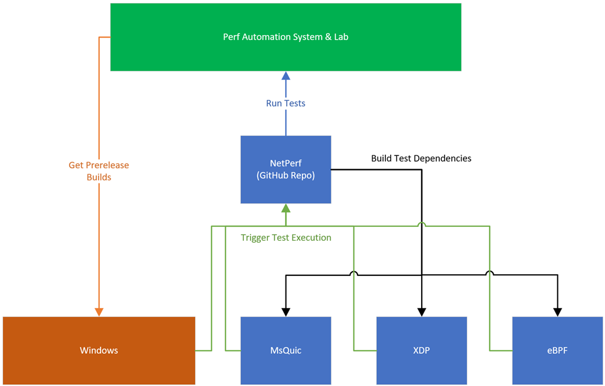

# Architecture

This repository maintains a GitHub Action for each different test scenario, [quic.yml](../.github/workflows/quic.yml) for MsQuic for instance, that can be triggered by any project with the appropriate access (controlled via PAT).  The Action then queues one or more jobs on the shared pool of dedicated hardware machines to run the necessary tests.



When a project needs performance testing to be run, it uses the [run-workflow.ps1](../run-workflow.ps1) script to trigger the appropriate test and wait for it to complete.  The script leverages the [GitHub REST API](https://docs.github.com/en/rest) to trigger the workflow, wait for it to complete and then use the result to pass or fail the original caller.  For example:

```yaml
steps:
- name: Run NetPerf Workflow
  shell: pwsh
  run: |
    $url = "https://raw.githubusercontent.com/microsoft/netperf/main/run-workflow.ps1"
    iex "& { $(irm $url) } ${{ secrets.NET_PERF_TRIGGER }} quic ${{ github.sha }} ${{ github.ref }} ${{ github.event.pull_request.number }}"
```

Output:

```
Run $url = "https://raw.githubusercontent.com/microsoft/netperf/main/run-workflow.ps1"
Triggering new workflow...
Looking for workflow run...
Run not found, retrying in 1 second...
Found: https://github.com/microsoft/netperf/actions/runs/6190561244
Waiting for run to complete...
Run succeeded!
```
