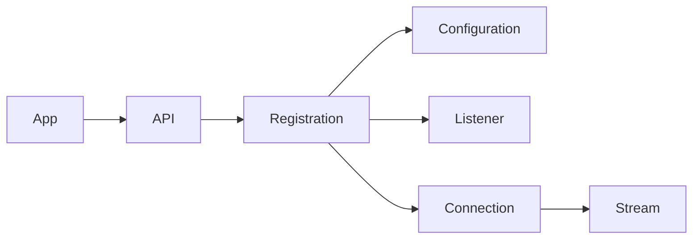

# V1

```mermaid
  graph LR;
      App-->API;
      API-->Registration;
      Registration-->Configuration;
      Registration-->Listener;
      Registration-->Connection;
      Connection-->Stream;
```
sql.jpg attached:

