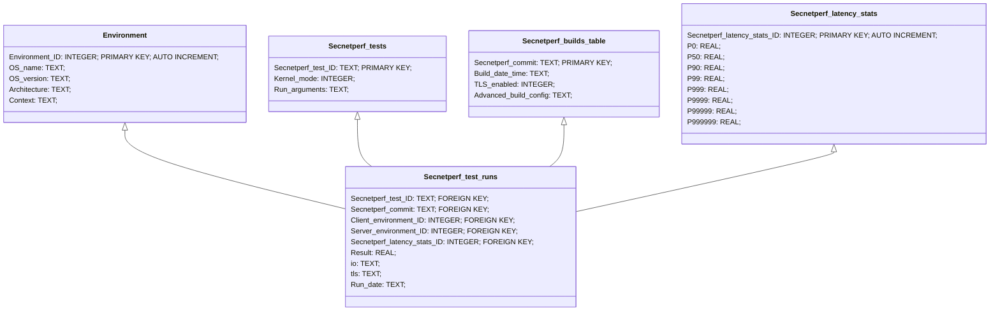

# V1

```mermaid
  classDiagram
    class Secnetperf_test_runs {
        Secnetperf_test_ID: TEXT; FOREIGN KEY;
        Secnetperf_commit: TEXT; FOREIGN KEY;
        Client_environment_ID: INTEGER; FOREIGN KEY; 
        Server_environment_ID: INTEGER; FOREIGN KEY;
        Secnetperf_latency_stats_ID: INTEGER; FOREIGN KEY; 
        Result: REAL; 
        io: TEXT;
        tls: TEXT; 
        Run_date: TEXT;
    }
    class Environment{
        Environment_ID: INTEGER; PRIMARY KEY; AUTO INCREMENT;
        OS_name: TEXT; 
        OS_version: TEXT; 
        Architecture: TEXT; 
        Context: TEXT; 
    }
    class Secnetperf_latency_stats{
        Secnetperf_latency_stats_ID: INTEGER; PRIMARY KEY; AUTO INCREMENT; 
        P0: REAL; 
        P50: REAL; 
        P90: REAL; 
        P99: REAL; 
        P999: REAL; 
        P9999: REAL; 
        P99999: REAL; 
        P999999: REAL; 
    }
    class Secnetperf_builds_table{
        Secnetperf_commit: TEXT; PRIMARY KEY; 
        Build_date_time: TEXT; 
        TLS_enabled: INTEGER; 
        Advanced_build_config: TEXT; 
    }

    class Secnetperf_tests {
        Secnetperf_test_ID: TEXT; PRIMARY KEY; 
        Kernel_mode: INTEGER; 
        Run_arguments: TEXT;
    }

    Environment <|-- Secnetperf_test_runs
    Secnetperf_tests <|-- Secnetperf_test_runs
    Secnetperf_builds_table <|-- Secnetperf_test_runs
    Secnetperf_latency_stats <|-- Secnetperf_test_runs
```
