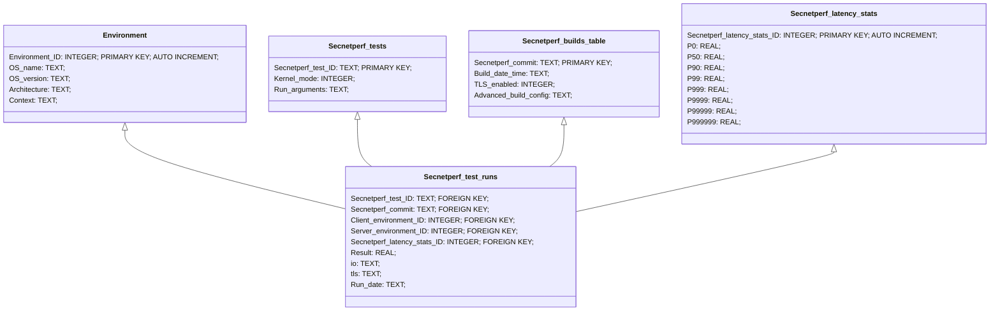
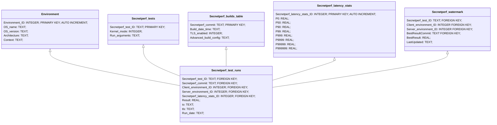

# V1

# V2 

The second iteration of the database design includes a Watermark table, that stores the 'best ever' result for each test / environment / io / tls configuration.

The workflow for each run still remains the same, except during the `regression.py` execution phase, we take into account Watermark SQL table. If we expect a regression, a dev can manully tweak the values in the Watermark table.

Because right now, the watermark we compute for `watermark-regression.json` is simply the local max over the last N runs.

