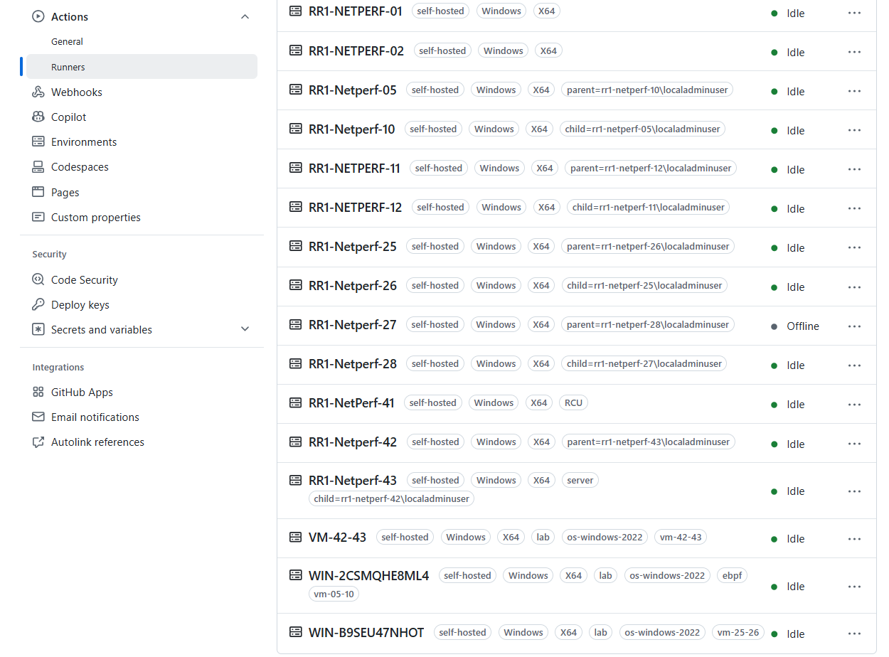

# Lab Management

## Github self-hosted runners

We use it for everything lab related. Self hosted runners are essentially agents running on a machine/VM that can accept jobs to execute. Netperf runs these agents in a service so it's always up and running.

The actual performance tests runs inside of a Hyper-V VM on the lab machine.
While this isn't bare-metal, we have optimized the host and VM to be as close to bare-metal as possible in terms of performance (enabling SR-IOV, 100 GB VM memory, 80 logical CPUs, etc...).

Netperf adds both the physical host and the VM as self-hosted runners to the Github backend. The physical host is responsible for reseting the VM to a clean state before each run, and the VM is responsible for running the actual performance test.

## Runner tags

As part of Github Action's backend, the tag system is what tells the Github backend which runner to assign to a specific job. Every tag must start with `self-hosted`.
Netperf has a protocol for tagging runners, and assigning them to certain jobs.
- All runners labelled `parent=xxx` or `child=yyy` are the actual physical hosts. No performance test job should be assigned to these runners.
- All runners labelled with the tag `vm-xx-yy` are the virtual machines, and performance tests should be assigned to these runners.




## Ephemeral Runners

The logic for acheiving statelessness between each lab run is done through the use of Hyper-V checkpoint resets. These resets happen on a schedule (every 6 hours) and after each performance test run. See the workflow: `.github/workflows/schedule-lab-reset.yml`. **Running the reset workflow will reset all the physical hosts added to the Netperf Bench.**

Source of truth for Netperf bench:  `.github/workflows/auto-reset-parent-or-child-lab-machine.yml` (the reset workflow):

```yaml
strategy:
      fail-fast: false
      matrix:
        vec: [
          { parent-or-child: "parent=rr1-netperf-26\\localadminuser",   vm-name: "netperf-windows-2022-client" },
          { parent-or-child: "child=rr1-netperf-25\\localadminuser",    vm-name: "netperf-windows-2022-server" },
          { parent-or-child: "child=rr1-netperf-05\\localadminuser",    vm-name: "netperf" },
          { parent-or-child: "parent=rr1-netperf-10\\localadminuser",   vm-name: "netperf" },
          { parent-or-child: "child=rr1-netperf-42\\localadminuser",    vm-name: "netperf-windows-2022-server" },
          { parent-or-child: "parent=rr1-netperf-43\\localadminuser",   vm-name: "netperf-windows-2022-client" },
          { parent-or-child: "child=rr1-netperf-11\\localadminuser",    vm-name: "netperf-linux-server" },
          { parent-or-child: "parent=rr1-netperf-12\\localadminuser",   vm-name: "netperf-linux-client" },
          # ... add more as we scale up the lab (purchase arm64 hardware)
        ]
```

You might be wondering what happens if we enqueue a reset workflow run while a perf job (on a lab hyper-V VM)
is still
running ~ would that cause a crash + loss of connectivity for the perf job? Yes. As such, Netperf has business logic in
the reset workflows to delay resetting until no active perf jobs are running. This is done through polling the Github
REST API.

Of course, this means that if we have 5 concurrent performance jobs enqueued but only 3 lab VM runners (6 physical hosts),
2 of the lab VM runners won't be in a clean state when it gets assigned the next perf job.

As such, the system isn't as comprehensive as a full-blown distributed system (like Azure 1ES). Given the limited resource constraints, this current solution is sufficient for our needs.

